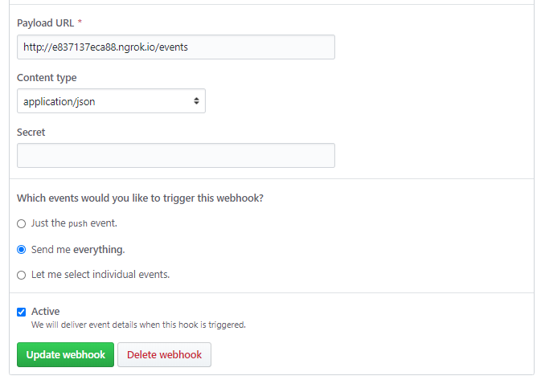

## About the challenge

Octo Events is an application that listens to Github Events via webhooks and expose by an api for later use.  
The application listen for `issue` events and store them.

### Stack

* Ruby 2.6.5
* Rails 5.2.4

### Gems

* [github_webhook](https://github.com/ssaunier/github_webhook)
* [rspec-rails](https://github.com/rspec/rspec-rails)
* [dotenv-rails](https://github.com/bkeepers/dotenv)

### Environment

List of required environment vars

|Name|Description|Required|
|--|--|--|
|GITHUB_WEBHOOK_SECRET|The secret specified in Github's webhook settings|Yes|

### Events entity

|Field|Type|Description|Rules|Default|
|:---|:--:|:----------|:---:|:-----:|
|`id`|int|ID of an event|unique,   read only|-|
|`action`|str|Action of an event|required|-|
|`number`|int|Number of the issue|required|-|
|`created_at`|datetime|Moment when event is created|read only|-|
|`updated_at`|datetime|Moment when event is updated|read only|-|

### Endpoints

|Path|Method|Status Code|Description|
|:---|:----:|:---------:|:----------|
|`/events`|`GET`|200|List all events|
|`/issues/:number/events`|`GET`|200|Get events of the issue `number`|
|`/events`|`POST`|201|Create a event|

#### GET `/events`

List all events

**Request:**
> GET /events

**Response:**

> 200 OK
```javascript
[ 
  {"id":11,"action":"edited","number":7,"created_at":"2020-06-17T16:05:36.000Z","updated_at":"2020-06-17T16:05:36.000Z"},
  {"id":12,"action":"edited","number":6,"created_at":"2020-06-17T16:35:21.000Z","updated_at":"2020-06-17T16:35:21.000Z"}
]
```

#### GET `/issues/:number/events`

Get all events of an issue by number

**Request:**
> GET /issues/6/events

**Response:**

> 200 OK
```javascript
[ 
  { "action": "edited", created_at: "2020-06-17T16:35:21.000Z"}
]
```

#### POST `/events` 

Create an issue event

**Request:**
> POST /events

**Response:**

> 201 Created
```javascript
  {"id":11,"action":"edited","number":7,"created_at":"2020-06-17T16:05:36.000Z","updated_at":"2020-06-17T16:05:36.000Z"}
```

## Testing specification

- **`should be able to create a new event`**: application must allow a event to be created and return a json with the created project.

- **`should be able to list the event`**: application must allow a event to be created and return a json with the created project.

- **`should be able to find events by number`**: application should allow searches with events number and return a json.

- **`should be able generate errors when trying to search for an unregistered events by number`**: application should not allow searches with number of events that do not exist.

## How to use

* Install the gems

```sh
bundle install
```

* Creating the database

```sh
rails db:create
```

* Running the migrations

```sh
rails db:migrate
```

* Running the server

```sh
rails s
```

* Running the tests

```sh
rspec
```

## Configuring ngrok

To use it locally you must use ngrok

* Install ngrok (https://ngrok.com/)

* Start a HTTP tunnel forwarding to your local port 3000

```sh
$ sudo ngrok http 3000 
```

## Configuring Webhooks

* Configure Webhooks in the repository

