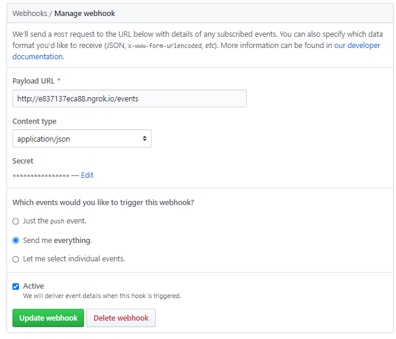

## About the challenge

Octo Events is an application that listens to Github Events via webhooks and expose by an api for later use.

### Events entity

|Field|Type|Description|Rules|Default|
|:---|:--:|:----------|:---:|:-----:|
|`pk`|int|ID of a event|unique,   read only|-|
|`action`|str|Action of a event|required|-|
|`number`|str|Number of a event|required|-|
|`created_at`|datetime|Moment when event is created|read only|-|
|`updated_at`|datetime|Moment when event is updated|read only|-|

### Events Actions

|Path|Method|Status Code|Description|
|:---|:----:|:---------:|:----------|
|`/events`|`GET`|200|List all events|
|`/issues/:number/events`|`GET`|200|Get a event object|
|`/events`|`POST`|201|Create a event|

### Testing specification

- **`should be able to create a new event`**: application must allow a event to be created and return a json with the created project.

- **`should be able to list the event`**: application must allow a event to be created and return a json with the created project.

- **`should be able to find events by number`**: application should allow searches with events number and return a json.

- **`should be able generate errors when trying to search for an unregistered events by number`**: application should not allow searches with number of events that do not exist.


### Local use

* Install the gem

```sh
bundle install
```

* Creating the database

```sh
rails db:create
```

* Running the migrations

```sh
rails db:migrate
```

* Upload application

```sh
rails s
```

* Run the tests

```sh
rspec spec
```
### Config ngrok and Webhooks

* Install (https://ngrok.com/)

* Start a HTTP tunnel forwarding to your local port 3000

```sh
$ sudo ngrok http 3000 
```

* Configure Webhooks in the repository


